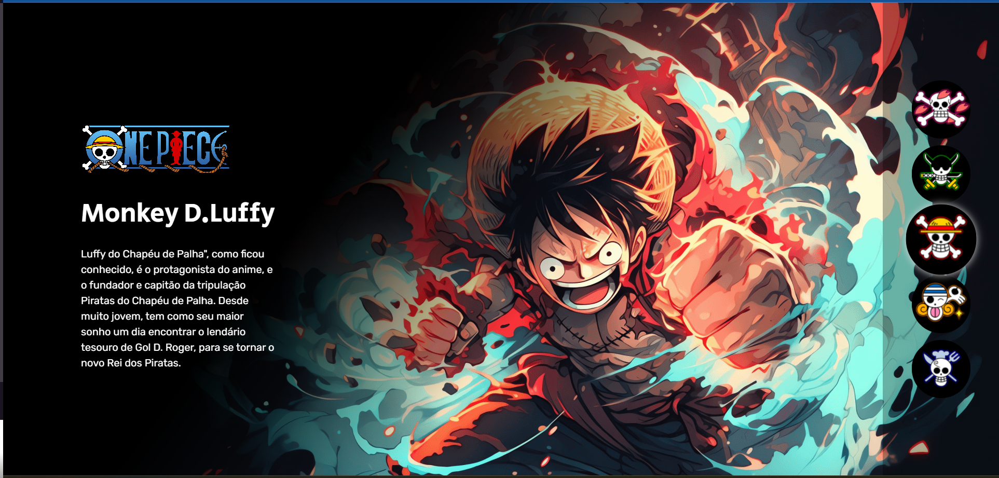

# Site One Piece
Este projeto consiste em uma página web tem informaçãoes dos personagens do anime One Piece. O projeto é ideal para iniciantes que querem aprender a  adicionar interatividade a uma página web em JavaScript, além de praticar habilidades básicas de HTML e CSS.

## Funcionalidade
Design responsivo: A página é responsiva, adequando-se a diferentes tamanhos de tela.

A seleção de botões e elementos associados, chamados "personagens", em uma interface de usuário. 

## Tecnologias Usadas

- HTML5
- CSS3
- JavaScript

## Estrutura de Arquivos

Site One Piece
- index.html
- src (Organizado com as respesctivas paginas Imagens; CSS; JS)

## Como Executar o Projeto

1. Clone o repositório para sua máquina local:https://github.com/guilherme-silvam/site-one-piece.git
2. Abra o arquivo `index.html` em um navegador de sua preferência.

## Visualização

Aqui está uma prévia de como o site aparece(Clique na imagem caso queira acessar o site)

## Contato

- E-mail: guisilvam19@gmail.com ou  guilhermemachado019@gmail.com
- Projeto Link: https://guilherme-silvam.github.io/site-one-piece/

